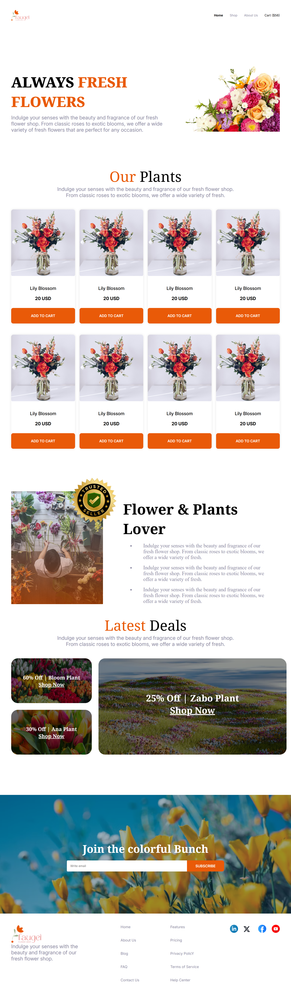

# 🌸 Flower Gloom — Responsive Flower Shop

A responsive flower shop landing page built with HTML and CSS as part of a web development project.

## 🌐 Live Website

🔗 [Visit Live Website](https://mijanurdev.github.io/Flowers-Gloom_Responsive/)

## 📸 Project Screenshot



## 📖 Project Overview

Flower Gloom is a responsive flower shop landing page designed using HTML and CSS.

The website showcases fresh flowers and plants with product cards, special deals, a newsletter section, and a clean footer layout.

## 🛠️ Main Technologies

- HTML5
- CSS3
- Google Fonts
  - Inter
  - Noto Serif

## ✨ Main Features

- Responsive design for desktop and mobile devices
- Navigation bar
- Hero/banner section
- Fresh flowers showcase
- Flower product cards
- Product pricing
- Add to Cart buttons
- Flower & Plants Lover section
- Animated Trusted Seller badge
- Latest Deals section
- Discount offer cards
- Newsletter subscription section
- Footer section
- Social media icons
- Hover effects
- Clean and modern user interface

## ⚙️ Dependencies

This project does not require any package installation, framework, or build tool.

It uses:

- HTML5
- CSS3
- Google Fonts (Inter and Noto Serif)

## 💻 How to Run Locally

1. Clone the repository:

```bash
git clone https://github.com/mijanurdev/Flowers-Gloom_Responsive.git
